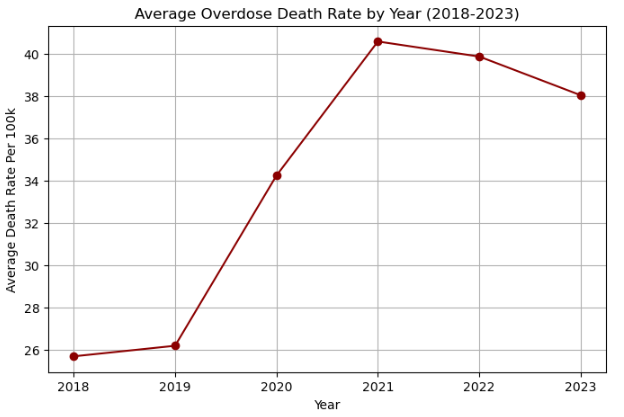
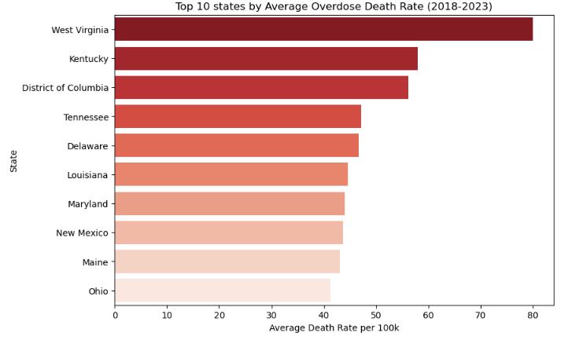
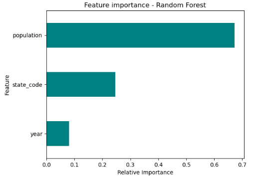

## CDC Overdose Mortality Prediction (2018–2023)

This project analyzes and predicts **drug overdose mortality rates** in U.S. counties using data from the **CDC WONDER “Multiple Cause of Death”** database (2018–2023).  
It demonstrates the full data-science workflow — from raw data cleaning to exploratory analysis, predictive modeling, and visualization.

---

## Project Structure
cdc-overdose-prediction/
├── data/ → raw and cleaned CDC datasets
├── notebooks/ → Jupyter notebooks for each stage
├── outputs/ → exported summaries and model predictions
└── README.md → project overview


---

## Data Source
**CDC WONDER: Multiple Cause of Death (2018–2023)**  
Dataset filtered for:
- *Drug poisoning (overdose)* (ICD-10: X40–X44, X60–X64, X85, Y10–Y14)
- Grouped by **State**, **County**, and **Year**

---

## Methods
### 1️. Data Cleaning
- Removed suppressed/unreliable records
- Converted numeric fields and standardized FIPS codes
- Calculated `death_rate_per_100k`

### 2️. Exploratory Data Analysis
- Yearly trends (2018–2023)
- Top 10 states by average overdose rate
- Distribution and correlation heatmaps
- Exported state-level summaries for dashboards (e.g., Power BI)

### 3️. Predictive Modeling
- Random Forest Regressor trained to predict `death_rate_per_100k`
- Input features: `year`, `population`, `state`
- Evaluation metrics: Mean Absolute Error, R²
- Feature-importance visualization

---

## Example Visuals

### Overdose trend by year 


### Top 10 states by average overdose rate  


### Feature importance from Random Forest


---

## How to Run

```bash
# 1. Clone repo
git clone https://github.com/<your-username>/cdc-overdose-prediction.git
cd cdc-overdose-prediction

# 2. Install dependencies
pip install -r requirements.txt

# 3. Open Jupyter notebooks
jupyter notebook

Next Steps

Merge with U.S. Census or CDC PLACES data to add socioeconomic predictors

Deploy Power BI dashboard using the exported summaries

Build a Streamlit or Hugging Face demo for interactive visualization